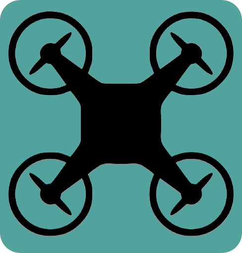

# TelloDrone Face Tracking
 [](https://opensource.org/licenses/MIT)

The `TelloDrone_FaceTracking` application uses openCV face detection along with djitellopy library in order to move the DJI Tello drone by detecting any face movement



## Installing the Application

Clone this repository in the modules folder
```sh
git clone https://github.com/ahmedwab/TelloDrone-FaceTracking
```

## Required Hardware:


Dji Ryze Tech Tello Quadcopter 720p Video Educational Drone
(https://store.dji.com/product/tello)

## Installing the Application

Ensure that you have the Latest Version of Python 3 installed.
That could be retrieved from https://www.python.org/downloads/

Moreover, to install all the dependencies you can do the following
```sh
	cd TelloDrone-FaceTracking
	bash dependencies.sh

```


## Running the application 

To run the application, you must first connect your compputer to the tello wifi


Navigate to the folder
```sh
cd TelloDrone-FaceTracking
```
Then, you can run it using the following command
```sh
python3 face_tracking.py
```


## Contributing

Contributing is greatly encouraged.

1. Fork the Project
2. Create your Feature Branch 
3. Commit your Changes 
4. Push to the Branch 
5. Open a Pull Request


## License

Distributed under the MIT License. See `LICENSE` for more information.
